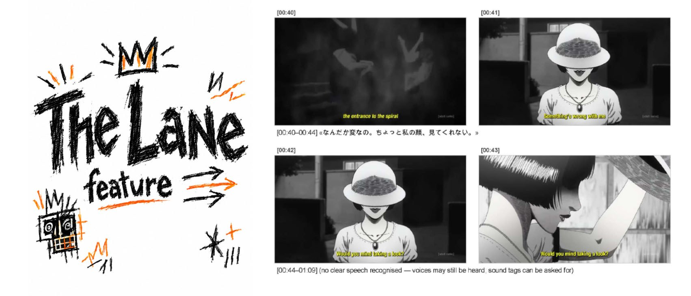
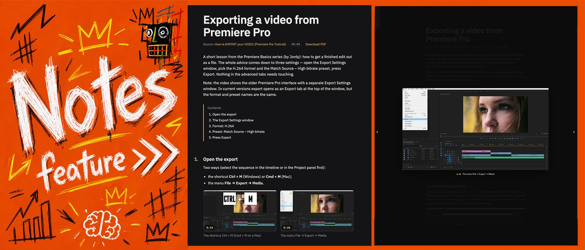

# V2L-IMT — let an AI agent or a chat model watch a video

Video to LLM · one Python file · macOS, Windows, Linux · Immersive Media Technologies

Most models do not take video, and the ones that do take a small file. `video2llm.py` turns any video — a
file or a link — into something a model can read and act on. It is the video pipeline of Deep Artisan,
trimmed to one file that runs anywhere, and it does two things:

- **The Lane** — the model *watches* the video: the frames tagged with their time, the words spoken at those
  moments, the sounds on request, and the rules on top — how to ask for more and what it will cost.
- **Notes** — the model *keeps* a lecture or a tutorial: one page with the key frames at the moments that
  matter, a PDF from the same page, at a web address of your own.

What sets it apart: the overview comes at one frame per second, and **every frame** of just the moment that
matters on request — never thinned; the **price is known before the question**, so the model asks with the
tokens named and you only say yes or no; **the script decides** whether a video is footage to watch or
something taught (then no frames of a talking person at all); the speech is recognised **locally** (or the
site's own captions are used), the sounds are tagged locally too, and the only download is the models from
this repository. One file, no server, no PyTorch; the same lane goes to an agent as images, to a chat as a
PDF or contact sheets, to an API as a request body.

## The Lane



**Give it a video, get a lane.** `python3 video2llm.py clip.mp4` — or a YouTube / Vimeo / direct link — and
the script writes `clip_frames/lane.md`: the frames in time order as contact sheets (three to an image, each
tagged `[mm:ss]`), the words spoken under each sheet with their time spans, and the rules on top. A link is
downloaded once (up to 1080p) and the site's own captions stand in for speech recognition. Where no speech
was recognised the lane says so — *voices may still be heard; sound tags can be asked for* — so the model
never reads a gap as missing material. For most questions — what happens, who does what, who says what —
the lane is all it needs, and nothing more is asked of you.

**The script decides what kind of video it is.** Footage to watch — a film, a clip, a vlog, home video —
gets the **overview**: one frame per second at 768 px (it reads faces and text), the speech between the
frames. Something taught, shown or explained — a lecture, a tutorial, a review, a talk — gets the
**lecture lane**: no frames of a talking person at all, the whole transcript with its chapters, and the
model asks for single larger frames at exactly the moments where the screen matters. The decision comes
from the site's category, the title and chapters, the length and the share of speech; the reasons are
printed, and `--frames 1` / `--frames none` overrule it.

**The model chooses the moments; you only say yes or no.** When one frame per second is not enough — a
fast gesture, a cut, the exact frame a hand touches something — the model does not guess and does not
ask you for timecodes. It names the moment itself and asks one question with the price: *«To answer this
I need every frame from [00:12] to [00:14] — about 12,700 tokens. Shall I?»* After your yes it gets every
frame of those seconds, never thinned (30 or 60 a second), and answers with a frame number. Sounds other
than speech — music, a slam, laughter, a crowd — work the same way: a local classifier tags what it hears
in the moment and brings the frames where it happens, so the model can say *who* laughs. The price is
known before the question because the header carries this video's real cost per frame, per second and
per part.

**Nothing but the script touches the video.** The model is told to use only the script's commands: no
ffmpeg of its own, no crops or zooms, no reading of working files. A chat that cannot run commands gets
the exact command to run and reads what it writes. The first run of a video takes 10–20 s (speech
recognition); every later run is under a second.

## Notes



A tutorial is worth keeping, not re-watching. When the model has answered about a lecture, a tutorial, a
how-to or a review, it asks one thing: *make the Guide (a step-by-step instruction) or the Notes (a talk)
of this video?* A film, a clip or a vlog never gets that question. After the yes the model writes the
structure — a title, an intro, the sections with their text and the moments whose frames illustrate them —
and the script builds **one page**:

- the frames are not a stream: each one is a **key image chosen by meaning** — the slide, the panel, the
  setting the author is talking about — cut at 1024 px so the text on screen is readable, and it opens
  full screen on a click (×, Esc, ←/→ for the next);
- a guide numbers its steps, a contents list appears from four sections, every frame carries its
  timecode;
- it is a **web document and a PDF at once**: the page has a *Download PDF* button that prints it through
  your browser into your downloads folder — two frames to a row, nothing breaks across pages;
- it is written in whatever language the model writes in.

**The address is yours.** The page goes to your own [Neocities](https://neocities.org) site (free: 1 GB,
and the page stays as long as the account does). The first time, a page opens on your computer with three
steps — sign up (a minute), copy the API key (Profile → Settings → Manage Site Settings → API Key), paste
it there; the key is kept in `~/.config/video2llm/` and never passes through a chat. Nobody is told about
the address and search engines are asked not to index it; share it with whom you mean to. `--github` puts
the page on your GitHub Pages instead. Nothing goes through us: V2L-IMT is the tool, the account, the page
and its content are yours — [TERMS.md](TERMS.md) says that in plain words.

```sh
python3 video2llm.py guide --spec guide.json        # the page + its frames → one folder
python3 video2llm.py link <that folder>             # its web address
```

## Why this one

Compared with the projects closest to it, from their READMEs as of 2026-10-07:

| | **V2L-IMT&nbsp;(this&nbsp;repo)** | claude-real-video | watch-cli | mathiaschu/<br>watch | peepshow | mcp-video-analyzer | llm-video-frames | Video2LLM (DiogoNeves) | Video-to-LLM-Context-Extractor |
|---|---|---|---|---|---|---|---|---|---|
| Form | one Python file (CLI) | CLI + MCP + skill + web | CLI + skill + MCP | Claude Code skill | CLI + plugins | MCP server | `llm` plugin | Python scripts | Electron app |
| **The Lane** | 1&nbsp;fps&nbsp;overview,&nbsp;or&nbsp;the lecture lane by the material; contact sheets with the words and sounds | scenes + dedup, ≥ 1 fps floor | 8 evenly spaced | auto, ≤ 2 fps, ≤ 100 | scenes + dedup, ≤ 40 | scenes + dedup, ≤ 60 | fixed fps | 10 fps, 20 max | intervals |
| **Every frame of a chosen moment** | **✅ on request, anchored on two overview frames, never thinned** | ❌ (dedup always on) | ❌ | ❌ (2 fps cap) | ❌ | partly (2–30 frame burst) | ❌ | ❌ | ❌ |
| **Token cost given to the model before it asks** | **✅ per frame, per second, per message** | in the docs | price per video (API) | ❌ | ❌ | ❌ | ❌ | ❌ | ❌ |
| Speech | local Whisper (Deep Artisan filters) or the site's captions | local Whisper / captions | hosted API (key) | captions / local Whisper | whisper.cpp / cloud | captions / Whisper / API | ❌ | ❌ | Google cloud |
| Sounds other than speech | **✅ local, free, on request per moment** | paid tier only | via Gemini API | ❌ | ❌ | ❌ | ❌ | ❌ | ❌ |
| **Notes** (a page with the key frames, PDF, an address of your own) | **✅ `guide` + `link`** | ❌ | ❌ | ❌ | ❌ | ❌ | ❌ | ❌ | ❌ |
| Chat outputs | **PDF (Claude / Gemini) + contact sheets (ChatGPT, any chat)** + API bodies | grid sheets, viewer | — | — | — | — | — | one image | PDF |
| Downloads at run time | **only from this repository** | Whisper models from their hosts | API calls | Whisper models from their hosts | Whisper models | models / APIs | — | OpenAI API | Google API |
| Video URLs (YouTube etc.) | ✅ via yt-dlp, optional | ✅ | ✅ | ✅ | direct URLs | ✅ | ❌ | ❌ | ❌ |
| Platforms named | macOS, Windows, Linux | macOS, Windows, Linux | macOS, Linux | macOS, Linux, Windows | macOS, Windows, Linux | macOS, Windows, Linux | macOS | — | Windows, macOS, Linux |

Ours and verified: the overview + frame-by-frame technique with anchors and the cost in the header; the
lecture lane and the Notes built from it; sounds on request with a local model and no PyTorch; outputs
chosen for how each chat really reads attachments; speech exactly as in Deep Artisan (Whisper with its
voice filter, doubtful lines dropped — compared line by line on real footage); every model downloaded from
this repository only. What others do and we do not: scene detection and de-duplication, an MCP server.

## Stack

One file, `video2llm.py`, on Python 3.9 or newer — no server, no daemon, no PyTorch, everything on the CPU:

| Part | What it does | How it gets there |
|---|---|---|
| **ffmpeg / ffprobe** | probes the video, cuts the frames (1 fps at 768 px; every frame at 512 px; key frames at 1024 px), extracts the audio | system package: brew / winget / apt |
| **faster-whisper** (Whisper on CTranslate2, int8) | the speech: Whisper *small* by default, *base* for speed, with Deep Artisan's voice filter and its rule for doubtful lines | `pip install faster-whisper`; the weights come from this repository's release |
| **PANNs CNN14** as ONNX on **ONNX Runtime** | the sounds other than speech — 527 AudioSet classes, 3 s of context around the moment | arrives with faster-whisper; the model comes from this repository's release |
| **Pillow** | the contact sheets (3 overview frames or 6 frame-by-frame ones to an image) | `pip install pillow`; without it the lane links one image per frame |
| **yt-dlp** | a video by link, with its captions | optional: `pip install yt-dlp` / `brew install yt-dlp` / `winget install yt-dlp` |
| **fpdf2** | `--format pdf` for chats | optional: `pip install fpdf2` |
| the standard library | the lanes, the manifest, the Notes page, the uploads, the API request bodies | — |

The frames and the lanes are written next to the video, the models go to `~/.cache/video2llm`
(Windows: `%LOCALAPPDATA%\video2llm`) once. The only network use is that one-time download from this
repository — plus a link you give it to fetch, an API key you give it to ask with, and the site you give it
the key of for the Notes.

## Install

The same script and the same files on macOS, Windows and Linux. On Windows write `python` instead of
`python3`, and `~` is `%USERPROFILE%`.

### 1. The script

```sh
# macOS
brew install ffmpeg
pip3 install faster-whisper pillow      # speech + contact sheets (ONNX Runtime for the sounds comes with it)
pip3 install yt-dlp fpdf2               # optional: video links, --format pdf

# Windows (PowerShell)
winget install Python.Python.3.12 Gyan.FFmpeg   # if you have no Python yet; then open a new PowerShell
pip install faster-whisper pillow
pip install yt-dlp fpdf2

# Linux
sudo apt install ffmpeg python3-pip
pip3 install faster-whisper pillow
pip3 install yt-dlp fpdf2
```

Download `video2llm.py` from the [latest release](../../releases/latest) (or clone this repository), put it
anywhere, run `python3 video2llm.py video.mp4`. If ffmpeg is not on PATH: `--ffmpeg PATH --ffprobe PATH`.
Windows on ARM: install the **x64** Python (the speech engine ships no ARM64 build for Windows; it runs
through Windows' emulation, a few times slower).

**What it downloads — once, only from this repository's release `models-v1`**, checksum-verified:
`faster-whisper-small.zip` (464 MB) at the first transcript; `panns_cnn14_dlmax.onnx` (312 MB) the first time
sounds are asked for; `faster-whisper-base.zip` (141 MB) only with `--whisper-model base`. Any other Whisper
size: `--whisper-model /path/to/a/ctranslate2-whisper-folder`.

### 2. Tell your agent

An agent does not know the script exists until its instructions say so. The [`agents/`](agents/) folder holds
**one section to add to the instructions your agent already has** — not a file to replace them. Step by step:

1. Open the instructions your agent already reads: the project's `AGENTS.md` (Codex CLI, Antigravity,
   Cursor), `CLAUDE.md` (Claude Code), `GEMINI.md` (Gemini CLI), `QWEN.md` (Qwen Code) — or the `SKILL.md`
   of a skill you already keep for this kind of work.
2. Paste the text of [`agents/AGENTS.md`](agents/AGENTS.md) at the end of it (Claude Code can take just the
   line `@agents/AGENTS.md` in `CLAUDE.md`).
3. Replace `/path/to/video2llm.py` in that text with where you put the script.
4. No such file yet? Make one: Claude Code — a folder `~/.claude/skills/video2llm/` with
   [`agents/SKILL.md`](agents/SKILL.md) and a copy of `video2llm.py` (no path to edit, found whenever a video
   comes up; Claude Cowork takes the same folder zipped at *Customize → Skills*); Cursor —
   [`agents/.cursor/rules/video2llm.mdc`](agents/.cursor/rules/video2llm.mdc) into the project's
   `.cursor/rules/`; Codex CLI / Antigravity — `AGENTS.md` in the project root (or `~/.codex/AGENTS.md`,
   `~/.gemini/AGENTS.md`); Gemini CLI — the same text as `GEMINI.md`; Qwen Code — as `QWEN.md`.
5. Or say it in the chat, once per conversation:
   `To watch a video, run: python3 /path/to/video2llm.py <video> — then read the lane it writes and follow its rules.`

The section says what an agent cannot learn from a lane it has not made yet: run the script instead of
opening the video, read the lane it chose, open every image, ask with the cost before `--frames all` /
`--sounds`, offer the Guide / Notes only for material to keep, never ffmpeg, allow the first run its time.
[`agents/README.md`](agents/README.md) lists the files per app.

### 3. Chats need nothing installed

| Where you ask | What to make | How |
|---|---|---|
| **Claude** (claude.ai, desktop) · **Gemini** (app / web) | `--format pdf` | attach `lane.pdf`: every page is read as text **and** as an image (Claude up to 100 pages, Gemini 1000); Gemini also takes the video file itself up to 5 min (`--native --format gemini`) |
| **ChatGPT** · any chat with image upload | `--format sheets` | attach the files of one `message-NN` folder per message — the contact sheets plus `about this video.txt` with the header and the whole transcript (ChatGPT reads images inside PDFs only on Enterprise) |
| **An API key** (Anthropic, OpenAI, Gemini) | `--format anthropic` / `openai` / `gemini` | a ready request body with the frames inlined; `--ask "…"` sends it with the key from `ANTHROPIC_API_KEY` / `OPENAI_API_KEY` / `GEMINI_API_KEY` |

Agents with a file tool (Claude Code, Claude Cowork, Codex CLI, Gemini CLI, Qwen Code, Cursor, Antigravity …)
read `lane.md` and open the contact sheets as images. Verified on 07.10.2026 with five agents — Opus 5.5,
GPT-6 Astra, Gemini 3.8 Flash, Qwen3.8 Max, Grok 4.7 — given the video and the one-line instruction above:
all five ran the script, answered from the sheets, named the moment themselves, asked with the cost, waited
for the yes, ran the frame-by-frame command and answered with a frame number (`#896 [00:29.87]`); for the
sounds all five found the laughter at 01:55–01:58 and the boy who laughs. Nobody ran ffmpeg.

## Use

```sh
python3 video2llm.py clip.mp4                                        # the lane the material calls for → clip_frames/lane.md (or lane_lecture.md)
python3 video2llm.py https://youtu.be/…                              # a video by link: downloaded once, its captions stand in for Whisper
python3 video2llm.py clip.mp4 --frames all --start 0:12 --end 0:14   # every frame from 0:12 to 0:14
python3 video2llm.py clip.mp4 --sounds --start 2:14 --end 2:22       # the sounds of that moment + the frames where they happen
python3 video2llm.py lecture.mp4 --frames at --times 3:12,7:40       # one 1024px frame at each moment (a slide, an interface, text)
python3 video2llm.py lecture.mp4 --frames none                       # the lecture lane by hand; --frames 1 — the overview by hand
python3 video2llm.py guide --spec guide.json                         # the Notes: one page with the key frames (Download PDF on it)
python3 video2llm.py link <the folder it printed>                   # its web address on your Neocities site (--github: GitHub Pages)
python3 video2llm.py long.mp4 --frames 1 --start 2:30                # the next part of a long overview → lane_from_02-30.md
python3 video2llm.py clip.mp4 --fps 3                                # a denser overview, 3 frames a second, into the same folder
python3 video2llm.py clip.mp4 --format pdf                           # lane.pdf for Claude / Gemini chats
python3 video2llm.py clip.mp4 --format sheets                        # contact sheets + text for ChatGPT / any chat
python3 video2llm.py clip.mp4 --format anthropic --ask "What goes wrong at 0:05?"   # key from ANTHROPIC_API_KEY
python3 video2llm.py clip.mp4 --sheet-frames 6                       # six frames to a sheet — half the files for a chat that counts them
python3 video2llm.py clip.mp4 --agent-tool video                     # for a harness with its own tool: the header says "call video with {…}"
```

```
video2llm 0.7.0 — IMG_2056.MOV
  [probe] 100% — 720×1280, 02:29, 30.00 fps, audio
  auto: footage to watch → the overview (--frames none for the lecture lane)
  [frames] 100% — 149 frames at 1/s
  [transcript] 100% — 24 segments (24 main), language ru (detected)
  lane.md: 149 frame(s) on 50 sheet(s)
  wrote /…/IMG_2056_frames/lane.md
```

**Where the files go.** Next to the video: `~/Downloads/clip.mp4` → `~/Downloads/clip_frames/`; a link lands
in `~/Movies/video2llm/downloads/` (`Videos\video2llm\downloads\`, `~/Videos/…`) and the lane beside it;
`--out DIR` puts them anywhere. A read-only folder (a share, a mounted image, Windows *Controlled folder
access*) sends the lane to your Videos folder, and the script says where; a cloud-synced folder gets a
warning that the frames will be uploaded too. A frame-by-frame segment, a later part or sound tags are
written **beside** the overview, never over it (`lane_00-12_00-14.md`, `lane_from_02-30.md`,
`sounds_02-14_02-22.txt`); a video already processed is not transcribed again.

```
clip_frames/
  frames_1fps_768px/                    00-00.jpg 00-01.jpg …          the overview
    sheets/                             sheet_00-00_00-02.jpg …        3 frames to an image, linked from lane.md
  frames_all_00-12_00-14_30fps_512px/   00-12.00.jpg 00-12.03.jpg …    frame by frame (+ sheets/, 6 to an image)
  frames_at_1024px/                     03-12.00.jpg …                 the key frames of a lecture
  audio.wav  transcript.txt             speech (16 kHz) and its lines
  lane.md · lane_lecture.md · lane_at_….md · lane_00-12_00-14.md · lane_sounds_….md   the lanes (+ a .json twin each)
  lane.pdf · sheets/ · payload.<provider>.json                        for chats and APIs
  video2llm.json                        manifest; a changed video is cut again
```

**How a model reads the frames.** An agent opens contact sheets — three overview frames side by side, each
at its own size with its tag above, the words and sounds of those frames under the sheet (`[00:07] → «…»
(speech 00:07.5–00:11.6)`). A sheet stays under Claude's limits (1568 px on the long side), so nothing is
downscaled and the tokens are the same as for the single frames, but there are a third as many images to
open — 50 reads instead of 149 for 2½ minutes, and the reads are most of an agent's time. `--single-frames`
goes back to one image per frame; `--sheet-frames 6` packs six (scaled to ≈ 74 %) for a chat that counts
files. Every `lane*.md` has a `lane*.json` twin with the same content as data, and `--agent-tool NAME`
makes the header ask the model to call that tool instead of giving it commands — that is how Deep Artisan
runs the script.

**What it costs**, by Anthropic's published formula for Claude, computed from the real frame size (GPT and
Gemini count by their own rules; the exact figure comes only with the response): a 720×1280 overview frame
≈ 448 tokens, a frame-by-frame frame ≈ 209, a second frame by frame ≈ 6,270 — about 14× the same second in
the overview; a 2½-minute overview ≈ 67,000. A whole 200k context holds about 5 minutes of overview at 1 fps
(2:36 at 2, 1:18 at 4).

## What the model is told

The first text block of every lane, PDF or sheet set — the rules, with this video's real commands and costs.
Shortened:

> [Video 1: video "IMG_2056.MOV", 02:29, 720×1280, with audio (automatic speech transcript — it can mishear
> words, read it with the frames). The images are contact sheets of consecutive frames of one moving picture,
> in time order — 3 frames to a sheet, each with its tag [mm:ss] above it … Rules:
> 1. The video is shown at 1 frame per second — the normal view. Open every sheet the question concerns — all
>    of them for a question about the whole video — and never describe from the transcript alone what you
>    have not seen in the frames. (A longer video: get the next part yourself, without asking — run `… --start 02:30`.)
> 2. You choose the moments, by what you see and hear — the user does not know the timecodes. Ask the user
>    only for a yes or a no, with the cost.
> 3. Frame by frame — when one frame per second cannot answer, do not guess; ask, e.g. "To answer this I need
>    every frame from [00:12] to [00:14] — about 12,749 tokens. Shall I?" After the yes, run `… --frames all
>    --start 00:12 --end 00:14` and look at its images.
> 4. Sounds other than speech are not in the lane. When the answer depends on them, ask the same way … If
>    nothing besides speech is found, say that no other sounds could be identified — not that there were none.
> 5. Ask before every request of rules 3 and 4 — the yes is for the tokens. The rest of the overview needs no yes.
> 6. Use only these commands for this video: no ffmpeg, no cropping or zooming, no working files — only the
>    images the lanes link to. If a detail is too small to tell, say so.
> 7. If the words show that this is something taught, shown or explained, switch to the lecture lane (`… --frames none`).
> Cost: an overview frame ≈ 448 tokens, a frame-by-frame one ≈ 209, a second frame by frame ≈ 6,270; the frames here ≈ 66,752.]

Each rule answers something models did in our tests: one described the second half of a video from the
transcript; one asked the user which seconds to look at; two cut frames with their own ffmpeg; several ran
a second paid request without asking. The lecture lane carries its own rules — where the screen matters,
how to ask for those frames, when to offer the Notes and when never — and the PDF and sheet sets carry the
same header worded for pages and attachments.

## Limits worth knowing

- **Links.** Whatever [yt-dlp](https://github.com/yt-dlp/yt-dlp) knows; one video of a playlist; up to 1080p;
  private or DRM-protected videos are not downloaded. The subtitles come along — the languages of `--captions`
  (default: your computer's UI language), the video's own, ru, en and the automatic original — and a manual track
  in the video's language is read before a machine translation; no captions → Whisper. Any `.vtt` / `.srt`
  beside a local file is used the same way; `--force-whisper` ignores them.
- **Parts.** 150 overview frames (2½ minutes, 50 sheets, ≈ 67,000 Claude tokens) per lane; a longer video
  comes in parts the model fetches itself. A 10-minute video watched whole is four parts, ≈ 270,000 tokens —
  the 768 px overview is the deliberate default, not the cheapest view; the lecture lane is the cheap one.
- **Speech.** Whisper small, as in Deep Artisan: unclear or children's speech gets misheard words, speech
  under noise may be left out — the header tells the model to read the words together with the frames.
  The seed is fixed (the same transcript on every run on one machine). `--whisper-model PATH` takes a
  larger model; `--language ru` overrides detection.
- **Sounds** are AudioSet classes (527, English): good at music, applause, laughter, engines, animals; they do
  not name a song or a person. `--sound-threshold` trades recall for precision.
- **Frame numbers.** The overview frame `[00:12]` is the first frame at or after 12.000 s; the frame-by-frame
  lane tags it `[00:12.00 #360]` — time and the frame's number in the video, so an answer can name the exact
  frame. A frame-by-frame request covers up to 4 s (120 frames); a longer moment is asked for in pieces.
- Token figures in the header are estimates for Claude.

## Platforms

macOS, Windows and Linux — the same code; paths, fonts, the Videos folder and cloud-sync detection are
handled per system. Verified by us: **macOS** (Apple Silicon; Python 3.9 and 3.14) — everything, end to end;
**Windows 11** (a Parallels VM on Apple Silicon, the x64 Python 3.12 under emulation, ffmpeg 9) — everything,
end to end, speech a few times slower; **Linux** (a clean container, Python 3.13) — the lanes, the sheets,
the API bodies, the read-only and cloud-folder fallbacks (speech and PDF not run there). The tests run on
all three in CI.

## License

[IMT Non-Commercial License](LICENSE) — the same as every Immersive Media Technologies project:

1. non-commercial use only — commercial or monetised use needs a written license from Immersive Media
   Technologies;
2. attribution is mandatory, visible to users, in the form
   `V2L-IMT by Immersive Media Technologies — https://github.com/Immersive-Media-Technologies`;
3. no warranty.

Notices for the models and tools it downloads: [THIRD-PARTY-NOTICES.md](THIRD-PARTY-NOTICES.md).
What the tool is and is not responsible for when the Notes get a web address: [TERMS.md](TERMS.md).

## Release history

Every version is on the [Releases](../../releases) page.

- v0.7.0 — Notes: `guide` (one page with the key frames — a lightbox, numbered steps, a Download PDF button) and
  `link` (your own address on Neocities; `--github` for GitHub Pages); `--frames auto` picks the lane by the
  material; the lecture lane ends with one question — make the Guide / the Notes?; `agents/` as a section to add.
- v0.6.1 — a subtitle the site refuses (YouTube 429 on captions) no longer takes the video down: once more
  without subtitles, then Whisper; exact caption codes only.
- v0.6.0 — the lecture lane (`--frames none`: no frames, the words and the chapters, the model asks for single
  frames where the screen matters), `--frames at --times` (one 1024px frame per moment), the lecture hint in
  `--download-only --json`.
- v0.5.1 — `--captions LANGS`: which subtitle languages to fetch and prefer; manual tracks before machine
  translations (yt-dlp's info file).
- v0.5.0 — the site's captions (and any `.vtt` / `.srt` beside a video) stand in for Whisper; `--download-only`
  for a program that runs the rest itself.
- v0.4.1 — `--yt-dlp` takes a command line too; the Windows test of the download path.
- v0.4.0 — a video by URL (YouTube, Vimeo, direct links — yt-dlp, optional): downloaded once up to 1080p into the
  Videos folder, then everything as for a local file; with `--agent-tool` the header names the frame files so an
  agent asked for one frame reads it instead of searching for it.
- v0.3.0 — `--sheet-frames N`: more frames to a sheet, scaled to Claude's limits — half the files for a chat
  that counts them (claude.ai); the header's costs follow.
- v0.2.0 — a denser overview on request (`--fps 2 | 3 | 4`, the frames join the same folder), `lane.json`
  beside every `lane.md` for a program that builds the model's message itself, `--agent-tool NAME` for a
  harness with its own tool (how Deep Artisan runs the script).
- v0.1.0 — first public version: overview + frame-by-frame on request with anchors and cost, sounds on
  request, lane.md / PDF / contact sheets / API bodies, models in this repository's release `models-v1`.
